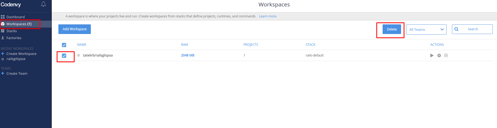
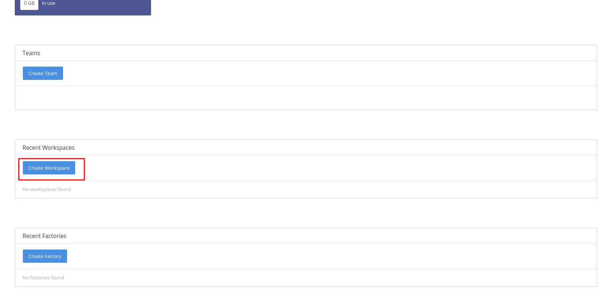
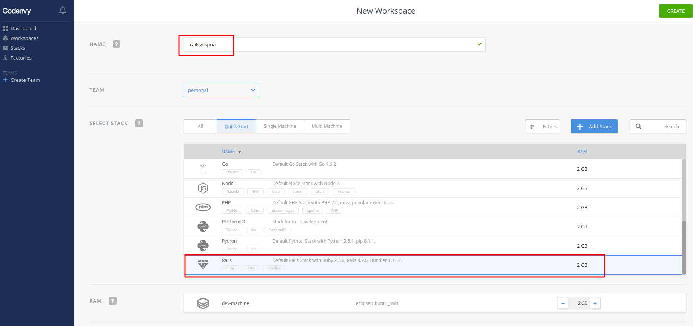
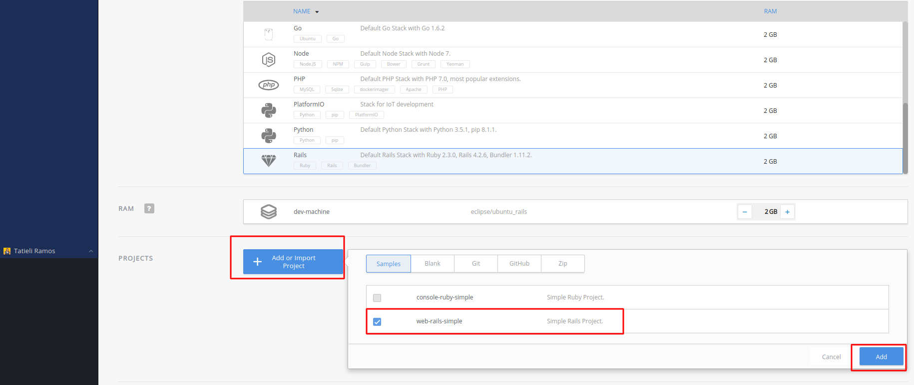
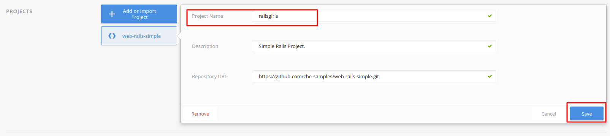
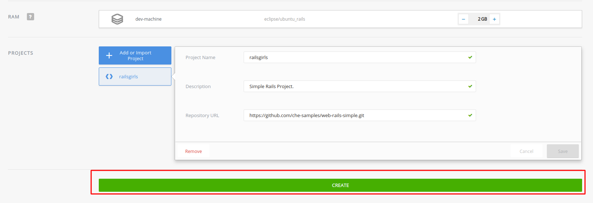
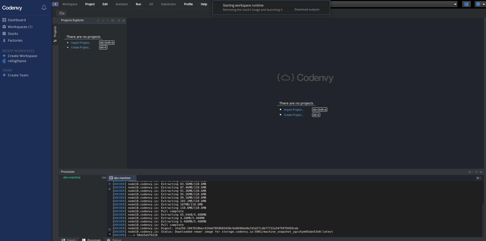

# O que é um Dashboard?

# Caso você já tenha usado o Codenvy

Caso a sua conta seja gratuita, você tem o limite de apenas um workspace (3GB de RAM). Neste caso, é interessante verificar se você já tem algum workspace criado, pois será necessário excluí-lo.

Siga para a seção _Workspaces_, no canto superior esquerdo, e selecione o container desejado. Após selecionar, clique em _Delete_ e confirme a exclusão clicando em _Delete_ novamente e aguarde até que uma mensagem de sucesso apareça na tela.

# Criando o nosso workspace <3

Na tela do dashboard (painel de controle em inglês), é necessário clicar no botão **"Create Workspace"** para criar uma nova área de trabalho, no retângulo onde esta escrito 'Recents Workspaces'.

Isso irá abrir a janela de criação de uma nova área de trabalho. Nesta janela, dê o nome "railsgirls" ao seu projeto, use a roalgem ou a caixa de busca para pesquisar por _Rails_ e selecionar a opção.
Para que tudo dê certinho, vamos nos certificar de escolher aquela que diz "Rails" e, na seção RAM, a opção "eclipse/ubuntu_rails":

Em seguida, vamos já adicionar o nosso projeto no workspace. Vamos clicar em _Add or import a project_ (Adicionar ou importar um projeto em inglês) e selecionar o projeto **web-rails-simple**, marque o checkbox, apos clique em _Add_.

Logo em seguida abaixo vai abrir uma opção, nós sugerimos trocar o nome desse projeto para **railsgirls** no campo "Project Name" para ficar mais fácil de achar ele depois, apos mudar o campo para o nome sugerido clicarmos em _save_.

Após salvar as modificações corretamente, clique em _Create_ e aguarde até que uma notificação de **Workspace is running** apareça na tela.

# Workspace 

# O que é um _workspace_?

Um workspace nada mais é do que a máquina virtual na qual você irá trabalhar. Quando criamos ela, com esta ferramenta, a máquina já vem com o sistema operacional e os programas que precisamos para fazer o nosso blog. 

