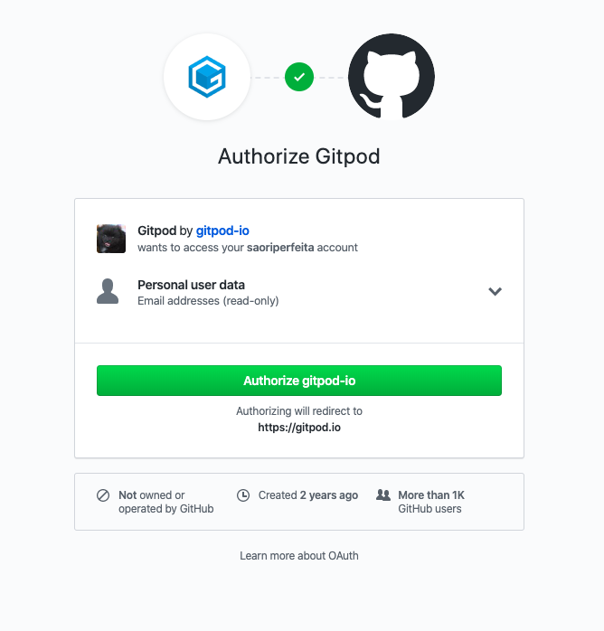

# Complete o cadastro

Após a confirmação do e-mail, vamos entrar diretamente no link da nossa máquina.

Você deverá ver uma imagem aparecida :

Vamos clicar em `Authorize gitpod.io`. Em seguida, veremos a seguinte tela:

Marque a primeira opção e clique em `Create free account`. Quando estiver tudo carregado, vamos ver a seguinte mensagem de boas vindas.

Vamos clicar em `Dismiss` e pronto!
