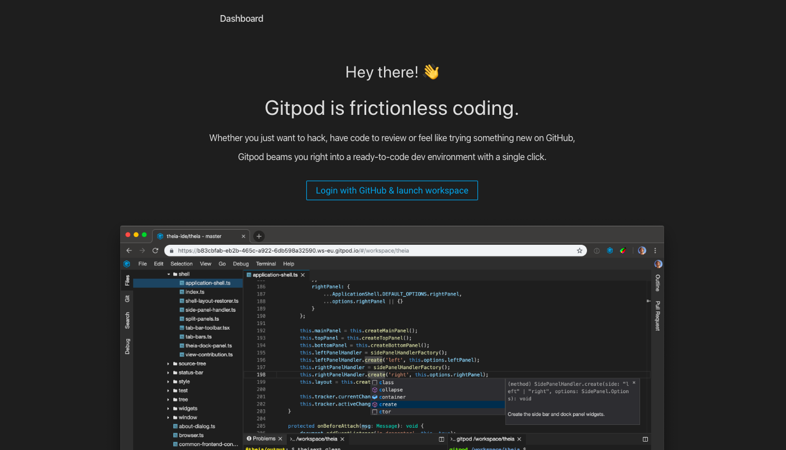

# Criando uma conta

O primeiro passo para utilizarmos o Gitpod é criar uma conta no Github. O Github é uma plataforma de hospedagem de código, permitindo que programadores de qualquer parte do mundo contribuam para os projetos.

Quando você acessar o link indicado na seção anterior e não estiver já logada no Github, verá a seguinte tela.

Vamos clicar no botão `Login with GitHub & launch workspace`. Você verá a tela a seguir. Se tiver uma conta do GitHub, é só colocar seu usuário e senha. Caso contrário, cliquei em `Create and account` bem embaixo da tela. Para criar uma nova conta você será redirecionada para um formulário pedindo nome, email, usuário e senha. Preencha este formulário.

# Escolha o plano FREE

Depois de inserir seus dados para uma nova conta, escolha o plano gratuito clicando em `Choose Free`.

# Valide seu e-mail

É necessário que você valide seu e-mail, então certifique-se de ter acesso a ele.

# Caso já tenha conta

Se loga aê e toca ficha :D
