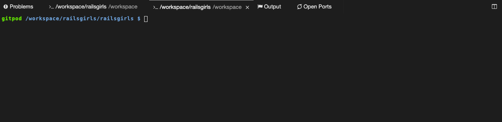

# Conhecendo a linha de comando

Para começar alguns experimentos, precisamos encontrar a nossa interface de linha de comando primeiro.

#### Prompt
Na mesma tela que você criou o seu projeto, abaixo do seu novo arquivo, você deve encontrar uma janela preta que está à espera de seus comandos.

Cada comando será antecedido pelo sinal **$** e um espaço, mas você não precisa digitá-lo. Seu computador fará isso por você :)

**Apenas uma pequena nota:** no seu caso, deve existir algo como `gitpod /workspace/railsgirls/railsgirls` antes do sinal do prompt e isto estará 100% correto. `gitpod` é a nossa ferramente e, em seguida, temos a pasta onde estamos. Vamos ver sobre isso com mais calma adiante, mas por enquanto pode ficar tranquila que está tudo certo.
