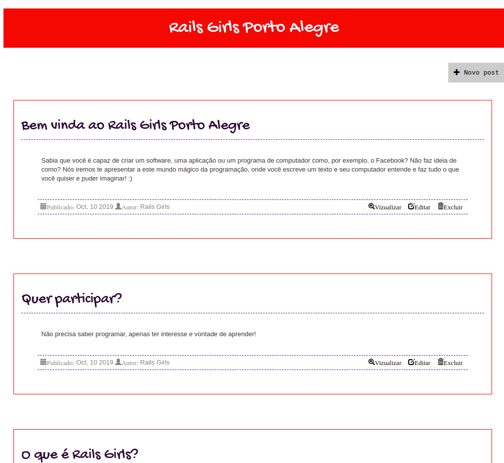

# Deixando o blog bonitinho

Agora que aprendemos um pouco mais sobre CSS e HTML, vamos nos divertir um pouco mudando o estilo do nosso blog?

No arquivo `app/assets/stylesheets/application.css`, adicione esse código:

```css
body {
  margin: 10px;
  font-family: "Lucida Console", Monaco, monospace
}

h1 {
  background: red;
  color: #ffffff;
  text-align: center;
  padding: 20px 0;
  margin-bottom: 30px;
  font-family: 'Gochi Hand', cursive;
}

.adicionar-post {
  width: 100%;
  display: inline-block;
  margin-bottom: 30px;
}

.adicionar-post a {
  border: solid 1px #cccccc;
  background: #ccc;
  padding: 10px;
  display: inline-block;
  float: right;
}

.adicionar-post a:hover {
  border: solid 1px #000;
  background: #000;
  color:#fff;
}

a {
  color: #000;
  padding: 5px;
}

.content {
    margin-left: 40px;
}

.date {
  float: left;
}

.details {
  border-bottom: 1px dashed #550b84;
  border-top: 1px dashed #550b84;
  padding: 5px;
  text-align: right;
  color: #828282;
}

.post {
    margin-right: 5px;
    margin-bottom: 70px;
    border: solid 1px red;
    padding: 15px;
}
.post h2 {
    color: #2c0335;
    border-bottom: 1px dashed #550b84;
    padding-bottom: 10px;
    font-family: 'Gochi Hand', cursive;
}

#posts {
  margin: 0 20px 0 20px;
}
```

Esse código adiciona um estilo a cada um dos nossos posts, dizendo que os títulos serão roxos, assim como dá um estilo diferente para as datas e nossos links.

Vamos ver como está ficando?



É isso por enquanto, mas ainda tem muito mais coisas que podemos alterar no nosso blog! Caso queira, podemos tirar um tempo para mudarmos mais o blog e deixá-lo ainda mais lindo :)

--

Para aprender um pouco mais sobre HTML e CSS para pode brincar e alterar cada vez mais o blog, indicamos esses sites:
- [http://www.w3schools.com/html/](http://www.w3schools.com/html/)

- [http://www.w3schools.com/css/](http://www.w3schools.com/css/)

- [https://www.codecademy.com/pt-BR/learn/web](https://www.codecademy.com/pt-BR/learn/web)

E não esqueça do Bootstrap:
- [http://getbootstrap.com/components/](http://getbootstrap.com/components/)
