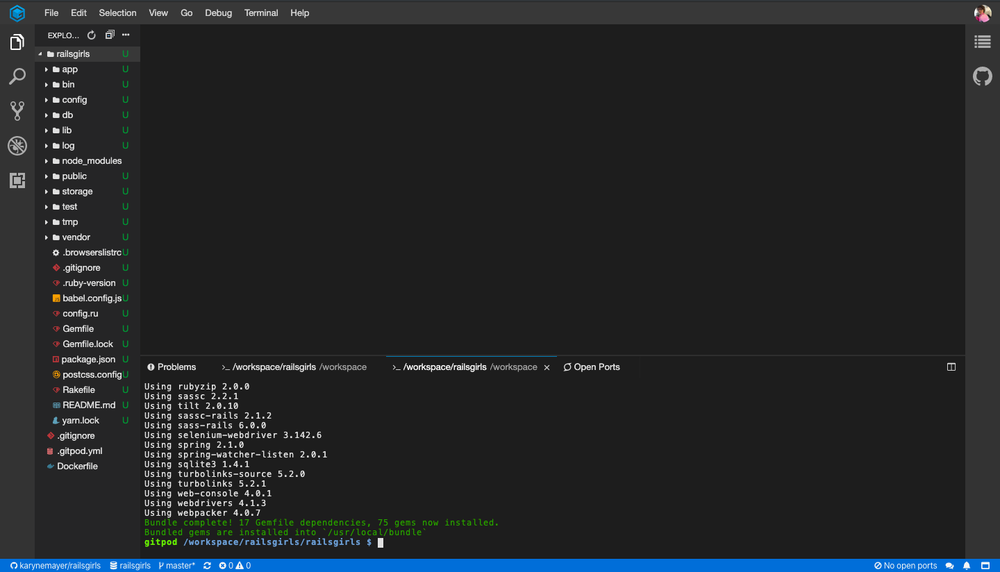
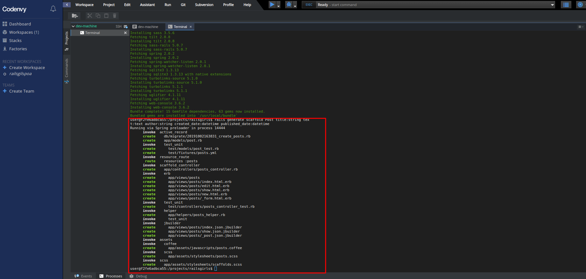
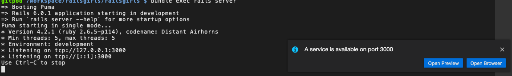
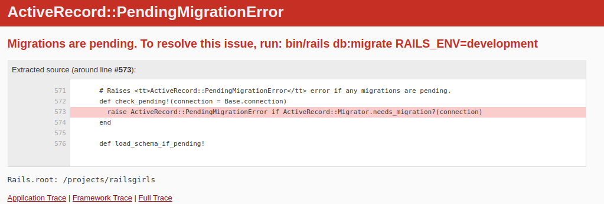

# Vamos começar a criar seu primeiro projeto Rails

No terminal, garanta que você está na pasta do projeto `railsgirls`. Você deve enxergar no terminal o seguinte texto `gitpod /workspace/railsgirls/railsgirls`. Em caso de dúvida, utilize o comando:

```sh
pwd
> /workspace/railsgirls/railsgirls
```
Depois de garantir que estamos na pasta certa, vamos executar este comando:

```sh
bundle install
```
O comando acima vai instalar alguns pacotes que vão nos ajudar a trabalhar com o Rails on Ruby em nossa aplicação.



```sh
bundle exec rails generate scaffold Post title:string text:text author:string created_date:datetime published_date:datetime
```
Esse comando vai criar uma série de arquivos que já vão possibilitar a criação, atualização e exclusão de posts.

Ta... mas que coisa mágica é essa????
Esta técnica de geração de código se chama **Scaffold**. A gente usa isto para não precisar criar todaaaaa a estrutura que precisamos na mão, se essa estrutura é comum a todo o mundo, entende? Vários sistemas tem sempre o **criar**, **atualizar** e **deletar** dados, né? O código é quase o mesmo! Pra todos esses lugares diferentes.

 Imagina que eu quero criar um blog pessoal, e você também, e a colega do lado. Se cada uma de nós fizéssemos sozinhas, cada uma de nós criaria basicamente o mesmo código no início. Com o **Scaffold**, basta a gente gerar o código que é comum à nós três (esse código do início) e cada uma de nós alteramos o que precisamos nele depois. Vai nos economizar bastante tempo, não acha? :D

Vou explicar rapidinho o que cada parte no comando faz, não usamos nenhuma mágica na verdade, era brinks :P


**bundle exec rails generate scaffold Post:** _generate Scaffold_ é o comando para o rails gerar essa estrutura de **criar**, **visualizar**, **atualizar** e **deletar** posts. Vai ser nosso início! E durante este tutorial, vamos refatorar o código criado.

**tittle:string text:text:** Quando falamos em "criar estrutura" estamos falando de criar migrações para criar as tabelas do banco de dados, por exemplo, entre outras coisas. Depois do comando principal `rails generate scaffold Post` nós colocamos o que iremos criar no banco de dados, que vai ser nosso lugarzinho onde iremos salvar o conteúdo dos posts. Neste caso, é uma coluna chamada "_title_" do tipo "_string_".
É a mesma coisa também nos outros: **author:string**, **created_date:datetime** e **published_date:datetime**, que "_author_", "_created_date_" e "_published_date_" são os nomes das novas colunas e logo em seguida aparece seus respectivos tipos.

Parece difícil, mas eu jurooo que não é :')
Todos esses termos técnicos a gente vai aprender como é na prática ao longo do tutorial ;) seeem stress :P

Ao longo do tutorial vamos mexendo nesses arquivos gerados ;)

CONTINUANDOOO

No terminal você verá uma lista da relação de arquivos, estes são todos os arquivos que ele cria. Neles estão incluídos os arquivos com código ruby, que faŕa tudo funcionar, e também com HTML, que é o que veremos no navegador.



Para rodar nosso projeto vamos digitar o comando abaixo:

```sh
bundle exec rails server
```

### Verificando se tudo está funcionando

Vamos ver o que temos aparecendo no navegador agora. Você verá a seguinte notificação no lado inferior direito da tela:




Recomendamos que você escolha `See Preview` para que fique tudo na mesma tela.

# Temos uns erros aqui!

Vamos ver o que temos aparece no navegador agora:



Ooops, algo estranho aconteceu. Esse é o nosso primeiro erro referente a nossa aplicação. Sempre que algo não estiver correto, o Rails irá avisar a gente com uma tela parecida com a da imagem, informando o erro que está acontecendo.

Como o idioma do Rails é inglês, essas mensagens serão em inglês, mas você sempre pode usar o Google Tradutor, se precisar.

### Ok, mas como resolver?

O que o Rails está nos dizendo é que nós criamos o Post, mas não dissemos como e onde vamos salvá-lo. A mensagem do início `Migrations are pending`, significa que criamos um arquivo, dizendo o que criar no banco de dados, mas não executamos ele. Vamos parar a execução da nossa aplicação com CTRL + C e fazer isso. No terminal digite:

```sh
bundle exec rake db:migrate
```

Esse comando, diz para o Rails executar todas as migrações que criamos. Esse arquivo foi criado ao executarmos o comando `scaffold`, que criou aquele monte de arquivos para a gente, lembra?

Deve aparecer algo parecido no terminal:
```
$ rake db:migrate
== 20171102171306 CreatePosts: migrating ======================================
-- create_table(:posts)
   -> 0.0019s
== 20171102171306 CreatePosts: migrated (0.0020s) =============================
```

### Vamos ver o que aparece no navegador agora?

Vamos digitar no terminal o seguinte comando novamente:

```sh
bundle exec rails server
```


Lindo!! Apareceu a tela de que indica que tudo está funcionando de novo! :D

Ok, mas onde estão os nossos posts?